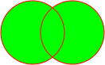
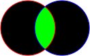
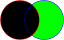
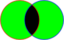
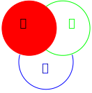
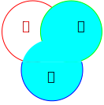
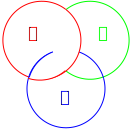
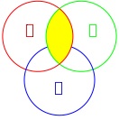
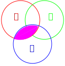

# Sets

Georg Cantor, a German mathematician, is considered the creator of set theory in the late 19th century.

## Definitions

### The pseudo definition of set

A set is an unordered collection. 

### Finite sets

A finite set is a set having a fixed number of elements.

### Infinite sets

An infinete set is a set that is not [finite](#finite-sets).

### Cardinality of a finite set

The cardinality of a [finite set](#finite-sets) is the number of its elements.

### Subsets

&#x1D434; set is a subset of &#x1D435; set if and only if every element of &#x1D434; is also an element of &#x1D435;.

### Set equality

Set &#x1D434; and set &#x1D435; equals if and only if &#x1D434; is a [subset](#subsets) of &#x1D435; and vice versal.

### The empty (null) set

The empty or null set is the set having no element. In convention, the empty set is a [subset](#subsets) of all other sets.

### The universe or the universal set

The universe set is the set of all elements.

## Operations

### Set union

<small>**Figure 1** - Venn diagram for set union</small>

The union of &#x1D434; and &#x1D435; sets is the set containing all elements of &#x1D434; and &#x1D435;.

&#x1D434; &#x222A; &#x1D435; = {&#x1D465; : &#x1D465; &#x2208; &#x1D434; &#x2228; &#x1D465; &#x2208; &#x1D435;}

- &#x1D434; = {&#x1D7F7;, &#x1D7F8;}, &#x1D435; = {&#x1D7F9;, &#x1D7FA;} &#x21D2; &#x1D434; &#x222A; &#x1D435; = {&#x1D7F7;, &#x1D7F8;, &#x1D7F9;, &#x1D7FA;}
- &#x1D434; = {&#x1D7F7;, &#x1D7F8;}, &#x1D435; = {&#x1D7F8;, &#x1D7F9;} &#x21D2; &#x1D434; &#x222A; &#x1D435; = {&#x1D7F7;, &#x1D7F8;, &#x1D7F8;, &#x1D7F9;} = {&#x1D7F7;, &#x1D7F8;, &#x1D7F9;}
- &#x2124; &#x222A; &#x2115; = &#x2124;

### Set intersection

<small>**Figure 2** - Venn diagram for set intersection</small>

The intersection of &#x1D434; and &#x1D435; sets is the set containing elements that are in both &#x1D434; and &#x1D435;.

&#x1D434; &#x2229; &#x1D435; = {&#x1D465; : &#x1D465; &#x2208; &#x1D434; &#x2227; &#x1D465; &#x2208; &#x1D435;}

- &#x1D434; = {&#x1D7F7;, &#x1D7F8;}, &#x1D435; = {&#x1D7F8;, &#x1D7F9;} &#x21D2; &#x1D434; &#x2229; &#x1D435; = {&#x1D7F8;}
- &#x2124; &#x2229; &#x2115; = &#x2115;
- &#x1D434; = {&#x1D7F7;, &#x1D7F8;}, &#x1D435; = {&#x1D7F9;, &#x1D7FA;} &#x21D2; &#x1D434; &#x2229; &#x1D435; = &#x2205;

### Disjoint sets

Two sets are disjoint if their intersection is [the empty set](#the-empty-null-set).

### The complement of a set relative to another one

<small>**Figure 3** - Venn diagram for the complement of the red set relative to the blue one</small>

The complement of a set &#x1D434; relative to another set &#x1D435; is the set containing all elelements in &#x1D435; but not in &#x1D434;.

&#x1D435; - &#x1D434; = {&#x1D465; : &#x1D465; &#x2208; &#x1D435; &#x2227; &#x1D465; &#x2209; &#x1D434;}

The complement of a set (relative to [the universe](#the-universe-or-the-universal-set)) is a set containing all elements not in it (but in [the universe](#the-universe-or-the-universal-set)).

&#x1D434;&#x1D436; = &#x1D448; - &#x1D434;

- &#x1D434; = {&#x1D7F7;, &#x1D7F8;}, &#x1D435; = {&#x1D7F8;, &#x1D7F9;} &#x21D2; &#x1D435; - &#x1D434; = {&#x1D7F9;} and &#x1D434; - &#x1D435; = {&#x1D7F7;}
- &#x1D434; = {&#x1D7F7;, &#x1D7F8;, &#x1D7F9;}, &#x1D435; = {&#x1D7F8;} &#x21D2; &#x1D435; - &#x1D434; = &#x2205; and &#x1D434; - &#x1D435; = {&#x1D7F7;, &#x1D7F9;}

### The symmetric difference of two sets

<small>**Figure 4** - Venn Diagram for the symmetric difference of red and blue sets</small>

The symmetric difference of two sets &#x1D434; and &#x1D435; is the set containing all elements in &#x1D434; and in &#x1D435; but not both.

&#x1D434; &#x2A01; &#x1D435; = (&#x1D434; &#x222A; &#x1D435;) - (&#x1D434; &#x2229; &#x1D435;)

- &#x1D434; = {&#x1D7F7;, &#x1D7F8;}, &#x1D435; = {&#x1D7F8;, &#x1D7F9;} &#x21D2; &#x1D434; &#x2A01; &#x1D435; = {&#x1D7F7;, &#x1D7F9;}

### The Cartesian product of two or more sets

The Cartesian product of two sets &#x1D434; and &#x1D435; is the set containing all possible ordered pairs whose first component is in &#x1D434; and the other in &#x1D435;.

&#x1D434; x &#x1D435; = {(&#x1D44E;, &#x1D44F;) : &#x1D44E; &#x2208; &#x1D434; &#x2227; &#x1D44F; &#x2208; &#x1D435;}

&#x1D434;&#x1D7F8; = &#x1D434; x &#x1D434; = {(&#x1D44E;, &#x1D44F;) : &#x1D44E; &#x2208; &#x1D434; &#x2227; &#x1D44F; &#x2208;&#x1D434;}

|&#x1D434; x &#x1D435;| = |&#x1D434;| x |&#x1D435;|

|&#x1D434;&#x1D7F8;| = |&#x1D434;|&#x1D7F8;

- &#x1D434; = {&#x1D7F7;, &#x1D7F8;}, &#x1D435; = {&#x1D7F9;, &#x1D7FA;} &#x21D2; &#x1D434; x &#x1D435; = {(&#x1D7F7;, &#x1D7F9;), (&#x1D7F7;, &#x1D7FA;), (&#x1D7F8;, &#x1D7F9;), (&#x1D7F8;, &#x1D7FA;)}
- &#x1D434; = {&#x1D7F7;, &#x1D7F8;}, &#x1D435; = {&#x1D7F9;, &#x1D7FA;} &#x21D2; &#x1D435; x &#x1D434; = {(&#x1D7F9;, &#x1D7F7;), (&#x1D7F9;, &#x1D7F8;), (&#x1D7FA;, &#x1D7F7;), (&#x1D7FA;, &#x1D7F8;)}
- &#x1D434; = {&#x1D7F7;, &#x1D7F8;} &#x21D2; &#x1D434; x &#x1D434; = {(&#x1D7F7;, &#x1D7F7;), (&#x1D7F7;, &#x1D7F8;), (&#x1D7F8;, &#x1D7F7;), (&#x1D7F8;, &#x1D7F8;)}

### The power set of a set

The power set of a set is the set containing all of its subsets.

- &#x1D434; = {&#x1D7F7;, &#x1D7F8;} &#x21D2; &#x1D4AB;(&#x1D434;) = {&#x2205;, {&#x1D7F7;}, {&#x1D7F8;}, {&#x1D7F7;, &#x1D7F8;}}

### Set membership tables

Let &#x1D434; &#x2282; &#x1D448; and &#x1D44E; &#x2208; &#x1D448;, the table represents whether &#x1D44E; is in &#x1D434; is a set membership table. If &#x1D44E; &#x2208; &#x1D434;, we note &#x1D7F7;; otherwise, &#x1D7F6; as the following:

|&#x1D44E; &#x2208; &#x1D434;
|:-:
|&#x1D7F6;
|&#x1D7F7;

Although we can use set membership tables and Venn diagrams to prove set theories, it's definitely not suitable when the number of sets is large.

Extend a set membership table to prove the distributive law of intersection over union
|&#x1D434;|&#x1D435;|&#x1D436;|&#x1D434; &#x2229; &#x1D435;|&#x1D434; &#x2229; &#x1D436;| &#x1D435; &#x222A; &#x1D436;|&#x1D434; &#x2229; (&#x1D435; &#x222A; &#x1D436;)|(&#x1D434; &#x2229; &#x1D435;) &#x222A; (&#x1D434; &#x2229; &#x1D436;)
|:-:|:-:|:-:|:-:|:-:|:-:|:-:|:-:
|&#x1D7F6;|&#x1D7F6;|&#x1D7F6;|&#x1D7F6;|&#x1D7F6;|&#x1D7F6;|&#x1D7F6;|&#x1D7F6;
|&#x1D7F6;|&#x1D7F7;|&#x1D7F6;|&#x1D7F6;|&#x1D7F6;|&#x1D7F7;|&#x1D7F6;|&#x1D7F6;
|&#x1D7F6;|&#x1D7F6;|&#x1D7F7;|&#x1D7F6;|&#x1D7F6;|&#x1D7F7;|&#x1D7F6;|&#x1D7F6;
|&#x1D7F6;|&#x1D7F7;|&#x1D7F7;|&#x1D7F6;|&#x1D7F6;|&#x1D7F7;|&#x1D7F6;|&#x1D7F6;
|&#x1D7F7;|&#x1D7F6;|&#x1D7F6;|&#x1D7F6;|&#x1D7F6;|&#x1D7F6;|&#x1D7F6;|&#x1D7F6;
|&#x1D7F7;|&#x1D7F7;|&#x1D7F6;|&#x1D7F7;|&#x1D7F6;|&#x1D7F7;|&#x1D7F7;|&#x1D7F7;
|&#x1D7F7;|&#x1D7F6;|&#x1D7F7;|&#x1D7F6;|&#x1D7F7;|&#x1D7F7;|&#x1D7F7;|&#x1D7F7;
|&#x1D7F7;|&#x1D7F7;|&#x1D7F7;|&#x1D7F7;|&#x1D7F7;|&#x1D7F7;|&#x1D7F7;|&#x1D7F7;

Use Ven diagrams to prove set distributive law of intersection over union

<small>**Figure 5** - Venn diagram for &#x1D434; &#x2229; (&#x1D435; &#x222A; &#x1D436;)</small>

<small>**Figure 6** - Venn diagram for (&#x1D434; &#x2229; &#x1D435;) &#x222A; (&#x1D434; &#x2229; &#x1D436;)</small>

## Theorems

### The distributive laws

#### Intersection over union

&#x1D434; &#x2229; (&#x1D435; &#x222A; &#x1D436;) = (&#x1D434; &#x2229; &#x1D435;) &#x222A; (&#x1D434; &#x2229; &#x1D436;)

#### Union over intersection

&#x1D434; &#x222A; (&#x1D435; &#x2229; &#x1D436;) = (&#x1D434; &#x222A; &#x1D435;) &#x2229; (&#x1D434; &#x222A; &#x1D436;)

### Power set cardinality

|&#x1D4AB;(&#x1D434;)| = &#x1D7F8;|&#x1D434;|

## Notations

|Notation|Description|Example
|:-:|-|-|
|&#x2208;|is an element of is a member of is in|&#x1D465; &#x2208; &#x1D434;
|&#x2209;|is not an element of is not a member of is not in|&#x1D465; &#x2209; &#x1D434;
|{}|(curly brackets) a set or a set builder|{&#x1D7F7;, &#x1D7F8;, &#x1D7F9;} {&#x1D44E;, &#x1D44F;, &#x1D450;} {&#x1D7F7;, &#x1D44E;, &#x1D7F8;, &#x1D44F;}
|&#x2758;set-name&#x2758;|the [cardinality](#cardinality-of-a-finite-set) of the set-name set|&#x2758;&#x1D434;&#x2758;
|...|(ellipsis) same as previous or next|{&#x1D7F7;, &#x1D7F8;, &#x1D7F9;, ..., &#x1D7FD;, &#x1D7FE;, &#x1D7FF;} {&#x1D7F7;, &#x1D7F8;, &#x1D7F9;, ...} {..., -&#x1D7F9;, -&#x1D7F8;, -&#x1D7F7;}
|&#x2758;|(vertical bar) such that or where|{&#x1D465; &#x2208; &#x2115; &#x2758; &#x1D7FF; < &#x1D465; < &#x1D7F7;&#x1D7F6;&#x1D7F6;} {&#x1D465; &#x2208; &#x211A; &#x2758; -&#x1D7F7; < &#x1D465; < &#x1D7F7;} {&#x1D7F8;&#x1D465; &#x2758; &#x1D465; &#x2208; &#x2124;}
|:|(colon) such that or where|{&#x1D465; &#x2208; &#x2115; : &#x1D7FF; < &#x1D465; < &#x1D7F7;&#x1D7F6;&#x1D7F6;} {&#x1D465; &#x2208; &#x211A; : -&#x1D7F7; < &#x1D465; < &#x1D7F7;} {&#x1D7F8;&#x1D465; : &#x1D465; &#x2208; &#x2124;}
|,|(comma) and|{&#x1D465; &#x2208; &#x2115; : &#x1D7FF; < &#x1D465; < &#x1D7F7;&#x1D7F6;&#x1D7F6;, &#x1D465; &#x2260; &#x1D7FB;&#x1D7F6;} {&#x1D7F9; + &#x1D7F8;&#x1D465; : &#x1D465; &#x2208; &#x2119;, &#x1D465; < &#x1D7F9;&#x1D7FF;} {&#x1D7FF;&#x1D465; : &#x1D465; &#x2208; &#x2124;, -&#x1D7F9; < &#x1D465;}
|&#x2119;|(Double-Struck Capital P) Positive number set|{&#x1D7F7;, &#x1D7F8;, &#x1D7F9;, ...}
|&#x2115;|Natural number set|{&#x1D7F6;, &#x1D7F7;, &#x1D7F8;, &#x1D7F9;, ... }
|&#x2124;|Integer set|{..., -&#x1D7F9;, -&#x1D7F8;, -&#x1D7F7;, &#x1D7F6;, &#x1D7F7;, &#x1D7F8;, &#x1D7F9;, ...}
|&#x211A;|Rational number set
|&#x211D;|Real number set
|&#x2102;|Complex number set|{&#x1D44E; + &#x1D44F;&#x1D456; : &#x1D44E;,&#x1D44F; &#x2208; &#x211D;, &#x1D456;&#x1D7F8; = -&#x1D7F7;}
|&#x2205;|[The empty (null) set](#the-empty-null-set)
|&#x1D448;|[The universe (universal set)](#the-universe-or-the-universal-set)
|&#x2282;|is a [subset](#subsets) of|&#x1D434; &#x2282; &#x1D435;
|&#x2284;|is not a [subset](#subsets) of|&#x1D434; &#x2284; &#x1D435;
|=|[equal](#set-equality)|&#x1D434; = &#x1D435;
|&#x2286;|is a [subset](#subsets) of or equal|&#x1D434; &#x2286; &#x1D435;
|&#x222A;|[set union](#set-union)|&#x1D434; &#x222A; &#x1D435;
|&#x2229;|[set intersection](#set-intersection)|&#x1D434; &#x2229; &#x1D435;
|-|[set complement](#the-complement-of-a-set-relative-to-another-one)|&#x1D435; - &#x1D434; or &#x1D434; - &#x1D435;
|set&#x1D436;|The [complement](#the-complement-of-a-set-relative-to-another-one) of the set (relative to [the universe](#the-universe-or-the-universal-set))|&#x1D434;&#x1D436; = &#x1D448; - &#x1D434;
|&#x1D448;&#x1D436;|The [complement](#the-complement-of-a-set-relative-to-another-one) of [the universe](#the-universe-or-the-universal-set)|&#x1D448;&#x1D436; = &#x1D448; - &#x1D448; = &#x2205;
|&#x2205;&#x1D436;|The [complement](#the-complement-of-a-set-relative-to-another-one) of [the empty set](#the-empty-null-set)|&#x2205;&#x1D436; = &#x1D448; - &#x2205; = &#x1D448;
|&#x2A01;|The [symmetric difference](#the-symmetric-difference-of-two-sets) of two sets|&#x1D434; &#x2A01; &#x1D435; = (&#x1D434; &#x222A; &#x1D435;) - (&#x1D434; &#x2229; &#x1D435;)
|x|The [Cartesian product](#the-cartesian-product-of-two-or-more-sets) of two sets|&#x1D434; x &#x1D435;
|&#x1D4AB;(set)|The [power set](#the-power-set-of-a-set) of a set|&#x1D4AB;(&#x1D434;)

## Funnies

### No matter order and repetition

- {&#x1D7F7;, &#x1D7F8;} = {&#x1D7F8;, &#x1D7F7;} = {&#x1D7F6;+&#x1D7F7;, &#x1D7F7;+&#x1D7F7;}
- {&#x1D7F8;, &#x1D7F8;} = {&#x1D7F8;}

### A set can contain other sets

- {&#x1D7F7;, &#x1D7F8;, {&#x1D7F7;, &#x1D7F8;}}
- {&#x2205;, &#x1D7F7;, &#x1D7F8;, {&#x1D44E;, &#x1D44F;}, {&#x1D7F7;, &#x1D44E;}, {&#x1D7F7;, &#x1D44F;}}

### Is an element of and is a subset of

- &#x1D434; = {&#x1D7F7;} and &#x1D435; = {&#x1D7F7;, &#x1D7F8;} &#x21D2; &#x1D434; &#x2282; &#x1D435; and &#x1D434; &#x2209; &#x1D435;
- &#x1D434; = {&#x1D7F7;} and &#x1D435; = {&#x1D7F7;, {&#x1D7F7;}} &#x21D2; &#x1D434; &#x2282; &#x1D435; and &#x1D434; &#x2208; &#x1D435;

### Complex or simple is up to you

- Even number set
  - {&#x1D7F8;&#x1D465; : &#x1D465; &#x2208; &#x2115;}
  - {&#x1D465; &#x2208; &#x2115; : &#x1D465; is even}
  - {&#x1D465; &#x2208; &#x2115; : &#x2203;&#x1D45B; &#x2208; &#x2115;, &#x1D465; = &#x1D7F8;&#x1D45B;}
  - {&#x1D465; &#x2208; &#x2115; : &#x2203;&#x1D45B; &#x2208; &#x2115; &#x2227; &#x1D465; = &#x1D7F8;&#x1D45B;}
  - {&#x1D465; &#x2208; &#x2115; : &#x2203;&#x1D45B; &#x2208; &#x2115; and &#x1D465; = &#x1D7F8;&#x1D45B;}
  - {&#x1D465; &#x2208; &#x2115; : &#x2203;&#x1D45B; &#x2208; &#x2115; (&#x1D465; = &#x1D7F8;&#x1D45B;)}
- Integer number set
  - &#x2124;
  - {&#x1D465; &#x2208; &#x2124;}
  - {&#x1D465; : &#x1D465; &#x2208; &#x2115; &#x2228; -&#x1D465; &#x2208; &#x2115;}

### Somehow similar

- Transitivity
  - (&#x1D434; &#x2282; &#x1D435;) &#x2227; (&#x1D435; &#x2282; &#x1D436;) &#x21D2; &#x1D434; &#x2282; &#x1D436;
- Commutativity
  - &#x1D434; &#x222A; &#x1D435; = &#x1D435; &#x222A; &#x1D434;
  - &#x1D434; &#x222A; (&#x1D435; &#x222A; &#x1D436;) = (&#x1D434; &#x222A; &#x1D435;) &#x222A; &#x1D436;
  - &#x1D434; &#x2229; &#x1D435; = &#x1D435; &#x2229; &#x1D434;
  - &#x1D434; &#x2229; (&#x1D435; &#x2229; &#x1D436;) = (&#x1D434; &#x2229; &#x1D435;) &#x2229; &#x1D436;
- (&#x1D434; &#x2282; &#x1D435;) &#x2227; (&#x1D434; &#x2282; &#x1D436;) &#x21D4; &#x1D434; &#x2282; (&#x1D435; &#x2229; &#x1D436;)
- &#x1D434; &#x2282; (&#x1D434; &#x222A; &#x1D435;)
- (&#x1D434; &#x2229; &#x1D435;) &#x2282; &#x1D434;
- (&#x1D434; &#x222A; &#x1D435; = &#x1D448;) &#x2227; (&#x1D434; &#x2229; &#x1D435;) = &#x2205; &#x21D2; &#x1D448; - &#x1D434; = &#x1D435;
- &#x1D434; &#x222A; &#x1D434;&#x1D436; = &#x1D448;
- &#x1D448;&#x1D436; = &#x2205;
- &#x2205;&#x1D436; = &#x1D448;
- (&#x1D434; &#x222A; &#x1D435;)&#x1D436; = &#x1D434;&#x1D436; &#x2229; &#x1D435;&#x1D436;
- &#x1D434; - &#x1D435; = &#x1D434; &#x2229; &#x1D435;&#x1D436;
- &#x1D434; &#x2282; &#x1D435; &#x21D4; &#x1D435;&#x1D436; &#x2282; &#x1D434;&#x1D436;
- &#x1D434; - &#x1D435; = &#x1D435; - &#x1D434; &#x21D4; &#x1D434; = &#x1D435;
- &#x1D434; &#x2A01; &#x1D435; = &#x1D435; &#x2A01; &#x1D434;
- &#x1D448; x &#x2205; = &#x2205;
- &#x1D434; x &#x1D435; = &#x1D435; x &#x1D434; &#x21D4; &#x1D434; = &#x1D435;
- |(&#x1D434; x &#x1D435;) &#x2229; (&#x1D435; x &#x1D434;)| = |&#x1D434; &#x2229; &#x1D435;|&#x1D7F8;
- &#x1D434; &#x2282; &#x1D435; &#x21D4; &#x1D434; x &#x1D436; &#x2282; &#x1D435; x &#x1D436;
- &#x1D4AB;(&#x2205;) = {&#x2205;}
- &#x1D4AB;({&#x1D7F7;}) = {&#x2205;, {&#x1D7F7;}}