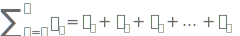
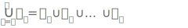
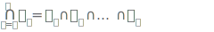

# Summations

where

- &#x1D458;: the index
- &#x1D44E;&#x1D458;: the general term
- &#x1D7F7;: the initial index
- &#x1D45B;: the terminal index

## Properties

&#x2211;&#x1D456; in &#x1D7F7;, &#x1D45B; (&#x1D44E;&#x1D456; + &#x1D44F;&#x1D456;) = &#x2211;&#x1D456; in &#x1D7F7;, &#x1D45B; &#x1D44E;&#x1D456; + &#x2211;&#x1D456; in &#x1D7F7;, &#x1D45B; &#x1D44F;&#x1D456;

&#x1D450; &#x2211;&#x1D456; in &#x1D7F7;, &#x1D45B; &#x1D44E;&#x1D456; = &#x2211;&#x1D456; in &#x1D7F7;, &#x1D45B; &#x1D450;&#x1D44E;&#x1D456; 

## Common forms

&#x2211;&#x1D456; in &#x1D7F7;, &#x1D45B; 1/&#x1D456;(&#x1D456;+&#x1D7F7;) = &#x1D45B;/&#x1D45B;+&#x1D7F7;

&#x2211;&#x1D456; in &#x1D7F7;, &#x1D45B; &#x1D456;&#x1D7F9; = &#x1D45B;&#x1D7F8;(&#x1D45B;+&#x1D7F7;)&#x1D7F8;/&#x1D7FA;

&#x2211;&#x1D456; in &#x1D7F6;, &#x1D45B; (&#x1D45B; &#x1D456;) &#x1D465;(&#x1D45B;-&#x1D456;)&#x1D466;&#x1D456; = (&#x1D465;+&#x1D466;)&#x1D456;

## Generalizations

