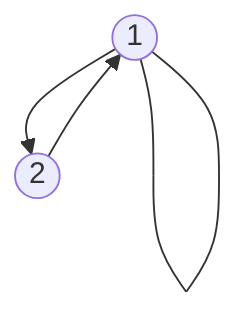
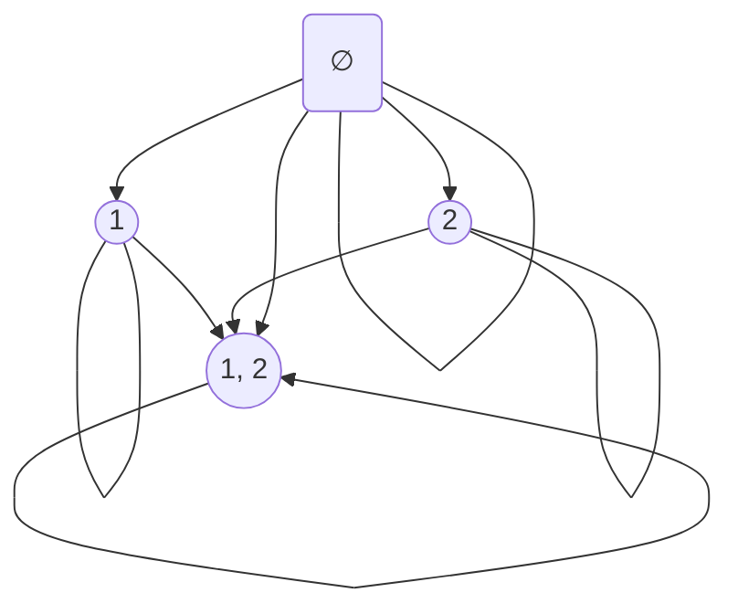

# The Directed Graph (Digraph) Of A Relation On A Set

## Definition

Let r be a relation on a set A. The graph used to represent r is a directed graph, where either a or b in a pair (a, b) of r is a vertex, and the arrow connects vertex a with vertex b is a directed edge (aka arc) representing arb. Note that we often represent ara by a line instead of an arrow.

## Example

### A = {1, 2}, r = {(1, 1), (1, 2), (2, 1)}

### A = {1, 2}, P(A) = {{}, {1}, {2}, {1, 2}}, r = {(∅, ∅), ({1}, {1}), ({2}, {2}), ({1, 2}, {1, 2}), (∅, 1), (∅, 2), (∅, {1, 2}), ({1}, {1, 2}), ({2}, {1, 2})}

