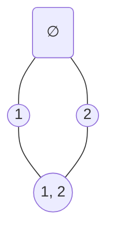

# Hasse Diagrams

Aka Ordering Diagram

## Description

From a directed graph of a relation, we can transform it into a Hasse diagram by
- Remove self-to-self edges
- Rearrange all edges to bottom-top (or top-bottom), and then remove arrows
- Remove edges that can be represented by a composition.

## Examples

### A = {1, 2}, P(A) = {{}, {1}, {2}, {1, 2}}, r = {(∅, ∅), ({1}, {1}), ({2}, {2}), ({1, 2}, {1, 2}), (∅, 1), (∅, 2), (∅, {1, 2}), ({1}, {1, 2}), ({2}, {1, 2})}

